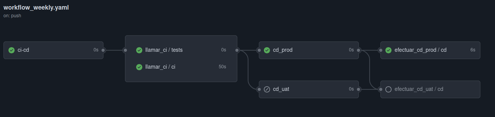
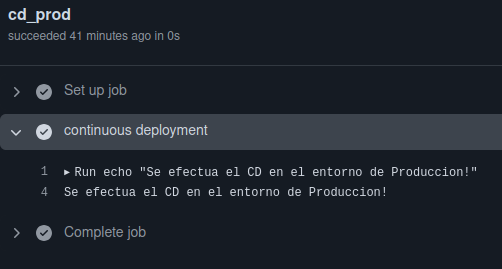
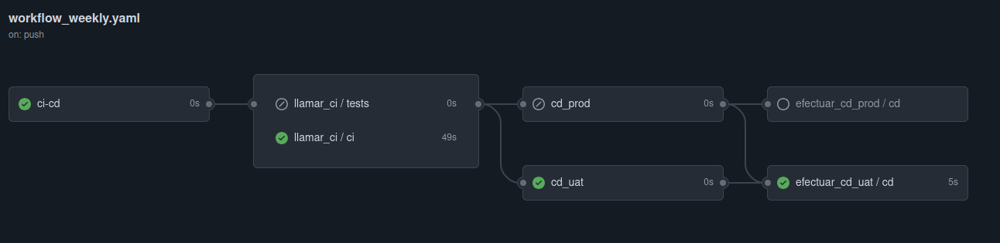
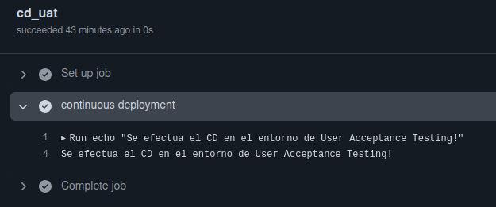

# Solucion Explicada

1) Este ejercicio consta de 4 ficheros .yaml:
    - `action.yaml`: Se trata de una action de tipo "composite" en el que coge la version del fichero `package.json` y el nombre de la imagen. Y lo que devuelve es el tag completo de la imagen de docker `<USER>/<NAME_IMAGE>:<VERSION>`.

    - `continuousIntegration.yaml`: Workflow reusable en el que se procede ha hacer todo el CI, donde se hace uso del `action.yaml` para obtener el tag completo de la imagen y con ello hacer el build y el push al registry(Dockerhub).

    - `continuousDeployment.yaml`: Workflow reusable en el que se procede ha hacer todo el CD, donde se pone como input el tag completo de la imagen obtenida del CI reusable y ya este reusable se encarga de hacer el pull de la imagen y de la ejecucion del contendor. Finalmente se comprueba con un curl al nginx.

    - `workflow_weekly.yaml`: El workflow principal donde se ejecuta todo lo anterior, haciendo uso de condicionales y environments. Que segun la rama donde se ejecute el push hace una cosa u otra. Las variables que he usado para definir cada entorno es `${{vars.ENTORNO}}`.

2) Acontinuacion se ven unas capturas donde se observa el funcionamiento del workflow principal:

- **Push Rama MAIN**

- **Push Rama DEVELOPMENT**

